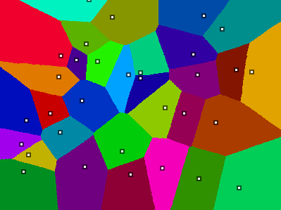

# Voronoi Generator

  
  
## About
This program randomly assigns points to a grid, then generates Voronoi polygons using a space-filling algorithm. There's not too much optimization done here, so it can be slow when using larger window sizes. For now, I've found the results to be satisfying enough to call it done.
  
Author: [paulpls](https://github.com/paulpls)  
License: [GPL 3.0](LICENSE.md)  

## Installation & Runtime
- Install [LÖVE](https://www.love2d.org)
- Clone the repo and `cd` into it
- Run `love .`

## Controls
| Key                | Description                               |
|:------------------:|:------------------------------------------|
| mouse button       | Add a point to the grid                   |
| spacebar           | Toggle animation on/off                   |
| r                  | Refresh the grid                          |
| q, ESC             | Quit                                      |

## License
  
    Copyright (C) 2023 Paul Clayberg
    
    This program is free software: you can redistribute it and/or modify
    it under the terms of the GNU General Public License as published by
    the Free Software Foundation, either version 3 of the License, or
    (at your option) any later version.
    
    This program is distributed in the hope that it will be useful,
    but WITHOUT ANY WARRANTY; without even the implied warranty of
    MERCHANTABILITY or FITNESS FOR A PARTICULAR PURPOSE.  See the
    GNU General Public License for more details.
    
    You should have received a copy of the GNU General Public License
    along with this program.  If not, see <https://www.gnu.org/licenses/>.

